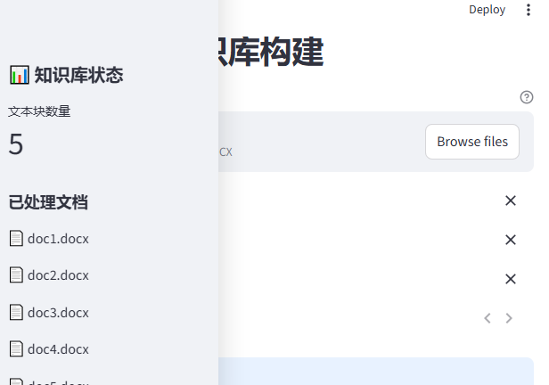
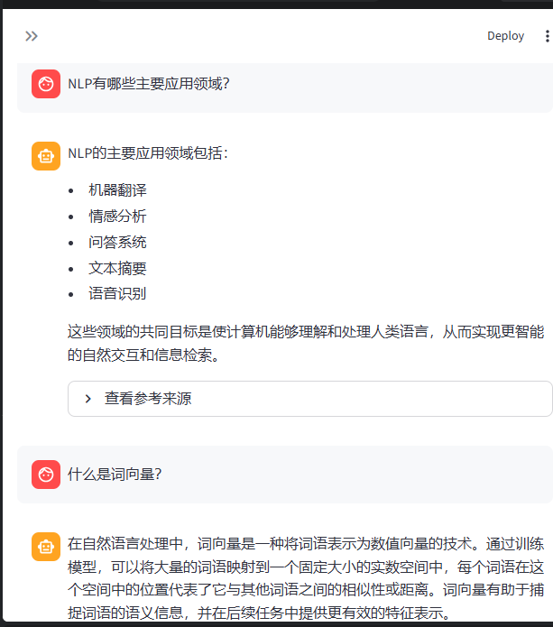
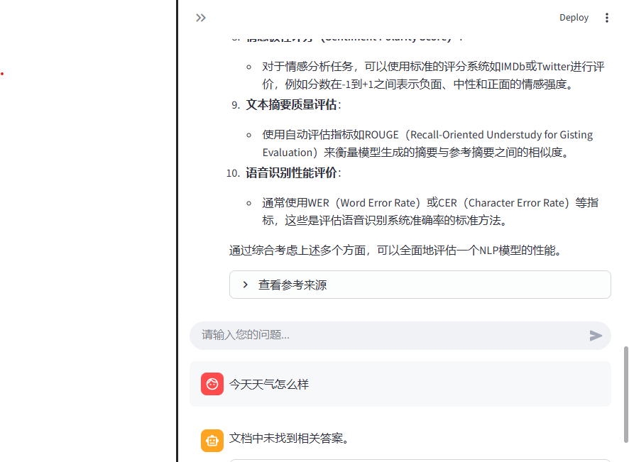

# RAG问答系统

## 项目简介

本项目是一个基于本地知识库的 RAG 智能问答系统，支持上传 PDF/DOCX 文档、构建向量知识库，并基于文档内容进行问答。
系统使用 Streamlit 构建 Web 界面，结合 Ollama 本地模型、LangChain 和 FAISS 实现检索增强生成。

## 环境要求与安装步骤

### 环境要求

- Python 3.9 或更高版本
- Windows、Linux 或 macOS
- Ollama 本地大模型服务
- 建议内存 8GB 以上

### 1. 安装 Ollama

访问 [Ollama 官网](https://ollama.com/) 下载并安装对应系统版本。

安装完成后启动 Ollama 服务：

```bash
ollama serve
```

如果 Windows 终端找不到 `ollama` 命令，可以使用 Ollama 安装目录中的完整路径运行，或将 Ollama 添加到系统 PATH。

### 2. 下载模型

本项目默认使用更快的轻量问答模型 `qwen2.5:1.5b` 和嵌入模型 `nomic-embed-text`：

```bash
ollama pull qwen2.5:1.5b
ollama pull nomic-embed-text
```

可选：如果希望使用推理能力更强但速度更慢的模型，也可以下载：

```bash
ollama pull deepseek-r1:7b
```

验证模型是否下载成功：

```bash
ollama list
```

### 3. 创建并激活 Python 虚拟环境

```bash
python -m venv venv
```

Windows：

```bash
venv\Scripts\activate
```

Linux/macOS：

```bash
source venv/bin/activate
```

### 4. 安装依赖库

```bash
pip install -r requirements.txt
```

## 使用说明

### 运行 Web 应用

在项目根目录执行：

```bash
streamlit run app.py
```

启动成功后，在浏览器打开：

```text
http://localhost:8501
```

### 上传文档并构建知识库

1. 打开 Web 页面后，先点击“初始化RAG系统”。
2. 进入“文档管理”标签页。
3. 上传 PDF 或 DOCX 文档，也可以使用项目内 `documents/` 文件夹中的样例文档。
4. 点击“构建知识库”，系统会提取文本、切分文本块、生成向量并保存到本地向量库。

### 提问

1. 进入“问答”标签页。
2. 在输入框中输入问题，例如“什么是自然语言处理？”。
3. 系统会先检索知识库中的相关内容，再调用 Ollama 模型生成回答。
4. 回答下方可展开查看参考来源。

### 命令行版本

```bash
python rag_chain.py
```

## 关键技术点说明

### RAG 流程

1. 文档读取：使用 `PyPDF2` 提取 PDF 文本，使用 `python-docx` 提取 DOCX 文本。
2. 文本切分：使用 LangChain 的 `RecursiveCharacterTextSplitter` 将长文档切分为文本块。
3. 向量嵌入：调用 Ollama 的 `nomic-embed-text` 模型生成文本向量。
4. 向量存储：使用 FAISS 保存本地向量索引，支持相似度检索。
5. 检索问答：根据用户问题检索相关文本块，将检索结果作为上下文交给大语言模型生成答案。

### 所用模型

- 问答模型：`qwen2.5:1.5b`
- 备用问答模型：`deepseek-r1:7b`
- 嵌入模型：`nomic-embed-text`

### 嵌入方式

系统通过 `langchain_ollama.OllamaEmbeddings` 调用本地 Ollama 嵌入模型，将文本块转换为向量后写入 FAISS 索引。

### 性能优化

- 默认使用 `qwen2.5:1.5b`，比 7B 推理模型响应更快。
- 使用 `keep_alive="10m"` 保持模型热加载，减少连续提问等待时间。
- 问答流程采用一次检索和一次模型生成，减少链路调用开销。

## 项目效果截图

### Web 首页



### 文档管理与上传


### 知识库构建结果



### 问答示例



## 测试问答效果

| 测试问题 | 预期效果 |
| --- | --- |
| 什么是自然语言处理？ | 基于知识库回答 NLP 的定义 |
| NLP 有哪些主要应用领域？ | 从文档中总结 NLP 应用 |
| 什么是词向量？ | 解释词向量概念 |
| Transformer 模型的优势是什么？ | 总结 Transformer 相关优势 |
| 今天的天气怎么样？ | 如果文档无相关信息，应提示文档中未找到相关答案 |

## 项目结构

```text
RAG-QA-System/
├── app.py                    # Streamlit Web 应用
├── rag_chain.py              # RAG 问答流程
├── vector_store.py           # FAISS 向量库管理
├── vector_store_chromadb.py  # ChromaDB 向量库实验版本
├── document_processor.py     # PDF/DOCX 文档处理
├── requirements.txt          # 依赖库列表
├── README.md                 # 项目说明
├── documents/                # 文档样例
├── 截图文件/                 # 项目截图
└── test_*.py                 # 测试脚本
```

## 打包为 EXE

```bash
pyinstaller --onefile --add-data "documents;documents" app.py
```

打包后的文件位于 `dist/` 目录。目标电脑仍需要安装 Ollama 并下载对应模型。

## 已知问题与改进方向

- 大模型首次响应需要加载模型到内存，首问可能较慢。
- PDF 中的图片和复杂表格暂未做结构化解析。
- 后续可增加 TXT、Markdown 等更多文档格式支持。
- 后续可增加知识库增量更新、文档删除和置信度评分。

## AI 使用声明

本项目使用 Trae AI 编程辅助工具进行开发和调试，辅助内容包括文档处理、向量库管理、RAG 问答链、Streamlit 页面和测试脚本。

## 许可证

MIT License
